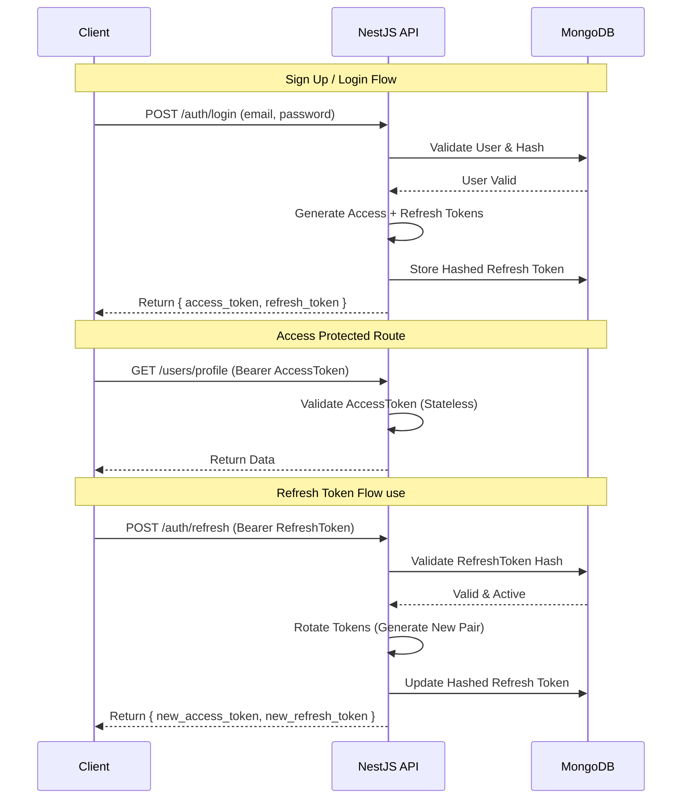

<p align="center">
  <a href="http://nestjs.com/" target="blank"></a>
</p>

# NestJS Advanced Backend Architecture

> A robust, scalable, event-driven backend service demonstrating **JWT Authentication** and a **Persistent Job Queue** implementation using MongoDB.

[](https://nestjs.com/)
[](https://www.mongodb.com/)
[](https://www.typescriptlang.org/)
[](http://www.passportjs.org/)

## 📖 Table of Contents

- [Introduction](#-introduction)
- [Architecture & Diagrams](#-architecture--diagrams)
- [Features](#-features)
- [Tech Stack](#-tech-stack)
- [Prerequisites](#-prerequisites)
- [Installation & Setup](#-installation--setup)
- [Running the App](#-running-the-app)
- [API Documentation](#-api-documentation)
- [Testing & Verification](#-testing--verification)
- [License](#-license)

---

## 🚀 Introduction

This project serves as a reference implementation for critical backend patterns in modern web applications. It moves beyond simple CRUD to handle **Secure Authentication** with token rotation and **Asynchronous Processing** for heavy tasks, ensuring the API remains fast and responsive.

---

## 🏗 Architecture & Diagrams

### 1. Authentication Flow (JWT)
The system uses **Access Tokens** (short-lived) for API access and **Refresh Tokens** (long-lived) for obtaining new access tokens. Refresh tokens are hashed in the database for security.



### 2. Job Queue Architecture (Producer-Consumer)
Instead of blocking the HTTP request for heavy tasks (e.g., sending emails, analytics), we offload them to a persistent MongoDB queue.

```mermaid
graph LR
    subgraph "Producer (API Request)"
    A[Client Request] --> B(UserService)
    B -->|Insert Job| C[(MongoDB 'jobs')]
    B -->|Immediate Response| A
    end

    subgraph "Consumer (Background Worker)"
    D[WorkerService] -->|Poll (Cron 1s)| C
    C -->|Lock Job (status: processing)| D
    D -->|Execute Task| E{Task Logic}
    E -->|Success| F[Update: Completed]
    E -->|Fail| G[Update: Failed]
    end
```

---

## ✨ Features

- **🔐 Secure Authentication**
  - **Bcrypt Hashing**: Passwords are continuously hashed.
  - **Token Rotation**: Secure Refresh Token implementation.
  - **Guards**: `AtGuard` (Access Token) and `RtGuard` (Refresh Token).
  - **Decorators**: Custom `@GetCurrentUser()` for clean code.

- **⚡ Asynchronous Job Queue**
  - **Persistence**: Jobs survive server restarts (stored in MongoDB).
  - **Reliability**: Atomic locking (`findOneAndUpdate`) prevents race conditions.
  - **Scalability**: Workers can be scaled horizontally.

- **🛡️ Type Safety**
  - Full **TypeScript** support with strict mode.
  - **DTOs** with `class-validator` for request validation.

---

## 🛠 Tech Stack

- **Framework**: [NestJS](https://nestjs.com/) (Node.js)
- **Language**: TypeScript
- **Database**: MongoDB (Mongoose ODM)
- **Auth**: Passport.js, JWT
- **Queue**: MongoDB-backed Custom Queue (Polled via `@nestjs/schedule`)

---

## 📋 Prerequisites

- **Node.js** (v16+)
- **npm** or **yarn**
- **MongoDB** Instance (Local or Cloud/Atlas)

---

## ⚙ Installation & Setup

1. **Clone the repository**
   ```bash
   git clone <repo-url>
   cd <project-folder>
   ```

2. **Install dependencies**
   ```bash
   npm install
   ```

3. **Configure Environment**
   Create a `.env` file in the root directory. You can copy the structure below:
   ```env
   MONGODB_URI="mongodb+srv://<user>:<password>@cluster.mongodb.net/dbname"
   # Redis config (Optional/Future use)
   REDIS_USERNAME="<username>"
   REDIS_PASSWORD="<password>"
   ```
   > **Note**: This project implements a custom MongoDB queue, so Redis is currently optional but configured for potential caching layers.

---

## ▶ Running the App

```bash
# development mode
npm run start:dev

# production mode
npm run start:prod
```

The application will start on `http://localhost:3000`.

---

## 📡 API Documentation

### Authentication & Users

| Method | Endpoint | Description | Auth Required |
| :--- | :--- | :--- | :--- |
| `POST` | `/users/signup` | Register a new user | ❌ |
| `POST` | `/users/login` | Login existing user | ❌ |
| `POST` | `/users/logout` | Logout (Revoke Refresh Token) | ✅ (Access) |
| `POST` | `/users/refresh` | Get new Access/Refresh Tokens | ✅ (Refresh) |
| `GET` | `/users/profile` | Get current user profile | ✅ (Access) |
| `GET` | `/users/:id` | Get user details by ID | ❌ |

---

## 🧪 Testing & Verification

### Functional Testing
Run the included script to verify the full Authentication flow (Signup -> Login -> Profile -> Refresh -> Logout).
```bash
npx ts-node scripts/test-auth.ts
```

### Load Testing (Queue Verification)
Run the heavy load script to simulate **50 concurrent requests**.
```bash
npx ts-node scripts/heavy-load.ts
```
**Observation**:
- The script finishes instantly (API is non-blocking).
- Check the terminal logs to see the **Worker** sequentially processing jobs in the background.

---

## 📄 License

This project is [MIT licensed](LICENSE) - free for personal and commercial use.
