<p align="center">
  <a href="http://nestjs.com/" target="blank"></a>
</p>

# NestJS Advanced Backend Architecture

> A robust, scalable, event-driven backend service featuring **JWT Authentication**, a **Redis Caching Layer**, and a **Persistent MongoDB Job Queue** with a producer-consumer pattern.

[](https://nestjs.com/)
[](https://www.mongodb.com/)
[](https://redis.io/)
[](https://www.typescriptlang.org/)
[](http://www.passportjs.org/)
[](https://swagger.io/)

---

## 📖 Table of Contents

- [Introduction](#-introduction)
- [Architecture & Diagrams](#-architecture--diagrams)
  - [High-Level System Architecture](#1-high-level-system-architecture)
  - [Authentication Flow (JWT)](#2-authentication-flow-jwt)
  - [Redis Caching Layer](#3-redis-caching-layer)
  - [Job Queue Architecture](#4-job-queue-architecture-producer-consumer)
  - [Event-Driven Architecture](#5-event-driven-architecture)
  - [Swagger / OpenAPI](#6-swagger--openapi)
- [Features](#-features)
- [Tech Stack](#-tech-stack)
- [Project Structure](#-project-structure)
- [Prerequisites](#-prerequisites)
- [Installation & Setup](#-installation--setup)
- [Running the App](#-running-the-app)
- [API Documentation](#-api-documentation)
- [Testing & Verification](#-testing--verification)
- [License](#-license)

---

## 🚀 Introduction

This project is a reference implementation for production-grade backend patterns in modern web applications. It goes well beyond simple CRUD to demonstrate:

- **Secure Authentication** with JWT access/refresh token rotation
- **Redis-powered Caching** for low-latency reads
- **Asynchronous Job Processing** via a MongoDB-backed queue with atomic locking
- **Event-Driven Design** using NestJS's `EventEmitter` for decoupled service communication

The API stays fast and responsive by offloading heavy work (emails, analytics) to a background worker, while Redis eliminates redundant database reads.

---

## 🏗 Architecture & Diagrams

### 1. High-Level System Architecture


---

### 2. Authentication Flow (JWT)

The system uses short-lived **Access Tokens** (15 min) for API access and long-lived **Refresh Tokens** (7 days) for obtaining new pairs. Refresh tokens are bcrypt-hashed before storage.

```mermaid
sequenceDiagram
    participant Client
    participant API as NestJS API
    participant DB as MongoDB

    Note over Client, DB: 🔐 Sign Up / Login Flow
    Client->>API: POST /users/login (email, password)
    API->>DB: Validate User & Compare Hash
    DB-->>API: User Valid
    API->>API: Generate Access Token (15m) + Refresh Token (7d)
    API->>DB: Store bcrypt-hashed Refresh Token
    API-->>Client: { access_token, refresh_token }

    Note over Client, DB: 🛡️ Access Protected Route
    Client->>API: GET /users/profile (Bearer AccessToken)
    API->>API: AtGuard → Validate Access Token (Stateless)
    API-->>Client: Return User Data

    Note over Client, DB: 🔄 Token Refresh Flow
    Client->>API: POST /users/refresh (Bearer RefreshToken)
    API->>DB: Find User → Compare Refresh Token Hash
    DB-->>API: Valid & Active
    API->>API: Rotate Tokens (Issue New Pair)
    API->>DB: Update hashed Refresh Token
    API-->>Client: { new_access_token, new_refresh_token }

    Note over Client, DB: 🚪 Logout
    Client->>API: POST /users/logout (Bearer AccessToken)
    API->>DB: Unset hashedRt field
    API-->>Client: 200 OK
```



---

### 3. Redis Caching Layer

Redis Cloud is used as a **read-through cache** for user lookups. When a user is fetched by ID, the service checks Redis first, falling back to MongoDB on a cache miss. Results are cached with a **120-second TTL**.


**Key implementation details:**

| Aspect | Detail |
| :--- | :--- |
| **Client** | `redis` npm package (`RedisClientType`) |
| **Hosting** | Redis Cloud (AWS us-east-1) |
| **Injection** | Custom `REDIS_CLIENT` provider via `RedisModule` |
| **Cache Key** | `user:{userId}` |
| **TTL** | 120 seconds |
| **Strategy** | Read-through (Lazy population) |

---

### 4. Job Queue Architecture (Producer-Consumer)

Instead of blocking HTTP requests for heavy tasks (e.g., sending welcome emails, analytics), we offload them into a **persistent MongoDB-backed job queue**. A background `WorkerService` polls for pending jobs every second and processes them with atomic locking.


#### Job Lifecycle


**Queue characteristics:**

| Property | Description |
| :--- | :--- |
| **Persistence** | Jobs survive server restarts (stored in MongoDB `jobs` collection) |
| **Atomicity** | `findOneAndUpdate` prevents race conditions across multiple workers |
| **Ordering** | FIFO — sorted by `createdAt` ascending |
| **Polling** | Every 1 second via `@nestjs/schedule` Cron |
| **Concurrency Guard** | `isProcessing` flag prevents overlapping polls |
| **Job Types** | `user.created`, `user.login` |

---

### 5. Event-Driven Architecture

The application uses `@nestjs/event-emitter` for decoupled, intra-process event handling. Service-layer actions (signup, login) emit domain events that listeners can react to independently.


---

### 6. Swagger / OpenAPI

The API is fully documented using **Swagger / OpenAPI 3.0** via `@nestjs/swagger`. An interactive UI is auto-generated from the controller and DTO decorators.


**Swagger configuration:**

| Setting | Value |
| :--- | :--- |
| **UI Endpoint** | `http://localhost:3000/api` |
| **JSON Endpoint** | `http://localhost:3000/api-json` |
| **Auth Schemes** | `access-token` (Bearer JWT), `refresh-token` (Bearer JWT) |
| **Tags** | `Auth`, `Users`, `Logs`, `App` |
| **Package** | `@nestjs/swagger` |

> After starting the server, visit **http://localhost:3000/api** to explore and test all endpoints interactively.

---

## ✨ Features

### 🔐 Secure Authentication
- **Bcrypt Hashing** — Passwords and refresh tokens are hashed with bcrypt (cost factor 10)
- **Token Rotation** — Refresh tokens are rotated on every use, preventing replay attacks
- **Guards** — `AtGuard` (Access Token) and `RtGuard` (Refresh Token) for route protection
- **Custom Decorators** — `@GetCurrentUser()` and `@GetCurrentUserId()` for clean controller code

### ⚡ Redis Caching
- **Read-Through Cache** — Transparent caching of user lookups with 120s TTL
- **Redis Cloud** — Production-grade hosted Redis instance
- **Cache Logging** — Every HIT, MISS, and SET is logged for observability

### 📮 Persistent Job Queue
- **MongoDB-Backed** — Jobs survive server restarts and crashes
- **Atomic Locking** — `findOneAndUpdate` prevents race conditions in multi-worker setups
- **FIFO Processing** — Jobs processed in creation order
- **Automatic Polling** — `WorkerService` polls every second via `@nestjs/schedule`

### 🎯 Event-Driven Design
- **Decoupled Services** — `@nestjs/event-emitter` for intra-process pub/sub
- **Domain Events** — `user.created` and `user.login` events drive side-effects

### 📜 Swagger / OpenAPI
- **Auto-Generated Docs** — Interactive Swagger UI at `/api` built from code decorators
- **Try-It-Out** — Test every endpoint directly from the browser
- **Dual Auth Schemes** — Supports both Access Token and Refresh Token authentication in the UI
- **Request/Response Schemas** — DTOs with `@ApiProperty` produce accurate request bodies and response models

### 🛡️ Type Safety & Validation
- Full **TypeScript** with strict mode
- **DTOs** validated with `class-validator` and transformed via `class-transformer`

### 📝 Structured Logging
- **File-based Logging** — Categorized logs (`system`, `requests`, `cache`, `worker`) written to disk
- **Request Middleware** — Every HTTP request is logged with method, path, status, and duration

---

## 🛠 Tech Stack

| Layer | Technology |
| :--- | :--- |
| **Framework** | [NestJS](https://nestjs.com/) v11 (Node.js) |
| **Language** | TypeScript 5 |
| **Database** | MongoDB (Mongoose ODM) |
| **Cache** | Redis Cloud (`redis` npm client) |
| **Auth** | Passport.js, `@nestjs/jwt` |
| **Queue** | Custom MongoDB-backed queue (`@nestjs/schedule`) |
| **Events** | `@nestjs/event-emitter` |
| **API Docs** | Swagger / OpenAPI 3.0 (`@nestjs/swagger`) |
| **Validation** | `class-validator` + `class-transformer` |

---

## 📁 Project Structure

```
app/
├── src/
│   ├── main.ts                  # Bootstrap + request logging middleware
│   ├── app.module.ts            # Root module (Mongo, Redis, Events, Worker)
│   ├── app.controller.ts        # Health check endpoint
│   ├── app.service.ts           # App service
│   ├── common/
│   │   ├── guards/              # AtGuard, RtGuard
│   │   └── decorators/          # @GetCurrentUser, @GetCurrentUserId
│   ├── user/
│   │   ├── user.controller.ts   # Auth & user endpoints
│   │   ├── user.service.ts      # Auth logic, Redis caching, job creation
│   │   ├── user.module.ts       # User module config
│   │   ├── dto/                 # AuthDto
│   │   ├── events/              # Domain event classes
│   │   ├── listeners/           # Event listeners
│   │   ├── strategies/          # Passport JWT strategies (AT, RT)
│   │   └── types/               # Token type definitions
│   ├── redis/
│   │   └── redis.module.ts      # Redis client provider & module
│   ├── worker/
│   │   ├── worker.module.ts     # Worker module (ScheduleModule)
│   │   └── worker.service.ts    # Cron-based job consumer
│   ├── schema/
│   │   ├── user.schema.ts       # Mongoose User schema
│   │   └── job.schema.ts        # Mongoose Job schema
│   └── logs/                    # Logs controller
├── utils/
│   ├── redis.ts                 # Redis client init (Redis Cloud)
│   ├── mongo.ts                 # MongoDB URI helper
│   └── logger.ts                # File-based logging utility
├── scripts/
│   ├── test-auth.ts             # Auth flow verification script
│   └── heavy-load.ts            # Load testing script (50 concurrent reqs)
├── .env                         # Environment variables
├── package.json
└── tsconfig.json
```

---

## 📋 Prerequisites

- **Node.js** v16 or higher
- **npm** or **yarn**
- **MongoDB** instance (local or [MongoDB Atlas](https://www.mongodb.com/atlas))
- **Redis** instance (local or [Redis Cloud](https://redis.com/cloud/))

---

## ⚙ Installation & Setup

1. **Clone the repository**
   ```bash
   git clone <repo-url>
   cd <project-folder>
   ```

2. **Install dependencies**
   ```bash
   npm install
   ```

3. **Configure environment variables**

   Create a `.env` file in the root directory:

   ```env
   # MongoDB
   MONGODB_URI="mongodb+srv://<user>:<password>@cluster.mongodb.net/dbname"

   # Redis Cloud
   REDIS_USERNAME="<username>"
   REDIS_PASSWORD="<password>"
   REDIS_DB=0
   ```

   > [!NOTE]
   > The Redis connection is configured for Redis Cloud (AWS us-east-1).
   > Update the host and port in `utils/redis.ts` if using a different provider.

---

## ▶ Running the App

```bash
# Development (watch mode)
npm run start:dev

# Production
npm run start:prod

# Debug mode
npm run start:debug
```

The server starts on `http://localhost:3000` (or the port specified in `PORT` env var).

On successful startup you should see:
```
MongoDB connected to cluster
Redis ping: PONG
Server is running on port 3000
Swagger docs available at http://localhost:3000/api
```

---

## 📡 API Documentation

### Swagger UI

Once the server is running, open **http://localhost:3000/api** in your browser to access the full interactive Swagger documentation. From there you can:

- Browse all endpoints grouped by tag (`Auth`, `Users`, `Logs`, `App`)
- View request/response schemas auto-generated from DTOs
- Authenticate using the **Authorize** button (paste your JWT)
- Execute requests directly with **Try it out**

> The raw OpenAPI JSON spec is also available at `http://localhost:3000/api-json`.

### Endpoints Overview

### Authentication & Users

| Method | Endpoint | Description | Auth |
| :--- | :--- | :--- | :---: |
| `POST` | `/users/signup` | Register a new user | ❌ |
| `POST` | `/users/login` | Login (returns tokens) | ❌ |
| `POST` | `/users/logout` | Revoke refresh token | 🔑 Access |
| `POST` | `/users/refresh` | Rotate token pair | 🔑 Refresh |
| `GET` | `/users/profile` | Get current user profile | 🔑 Access |
| `GET` | `/users/:id` | Get user by ID (Redis-cached) | ❌ |

### Example: Signup

```bash
curl -X POST http://localhost:3000/users/signup \
  -H "Content-Type: application/json" \
  -d '{"name": "John", "email": "john@example.com", "password": "securePass123"}'
```

**Response:**
```json
{
  "access_token": "eyJhbGciOiJIUzI1NiIs...",
  "refresh_token": "eyJhbGciOiJIUzI1NiIs..."
}
```

### Example: Access Protected Route

```bash
curl http://localhost:3000/users/profile \
  -H "Authorization: Bearer <access_token>"
```

---

## 🧪 Testing & Verification

### Functional Testing

Run the included script to verify the full authentication flow end-to-end:

```bash
npx ts-node scripts/test-auth.ts
```

This tests: **Signup → Login → Profile → Refresh → Logout**

### Load Testing (Queue Verification)

Simulate **50 concurrent requests** to verify the non-blocking queue:

```bash
npx ts-node scripts/heavy-load.ts
```

**What to observe:**
1. The script returns almost instantly (API is non-blocking)
2. Terminal logs show the `WorkerService` sequentially processing jobs in the background
3. Jobs transition through: `pending → processing → completed`

### Unit Tests

```bash
# Run all tests
npm run test

# Watch mode
npm run test:watch

# With coverage
npm run test:cov
```

---

## 📄 License

This project is [MIT licensed](LICENSE) — free for personal and commercial use.
